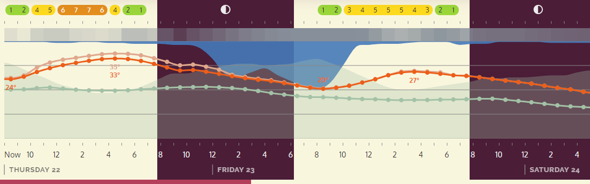

# Lekaro

A modern UI for displaying Dark Sky weather forecasts. [Try it out here](https://lekaro.yishn.uber.space).

## Bullding

Building requires Node.js and npm. First, clone this repository and install all the dependencies:

~~~
$ git clone https://github.com/yishn/p2p-goban
$ cd p2p-goban
$ npm install
~~~

To use Lekaro, you need to [sign up for a free Dark Sky API key](https://darksky.net/dev). Open `config.demo.js`, replace the value of `darkSkyApiKey` with your API key, adjust the `port` if necessary, and save it under `config.js`.

For development, use the following command to create a bundle automatically while you edit files:

~~~
$ npm run watch
~~~

For production, use the following command instead:

~~~
$ npm run build
~~~

To start the server, run:

~~~
$ npm start
~~~

Now, open `localhost:13442` in a modern browser (replace `13442` if you changed the `port` in `config.js`).
